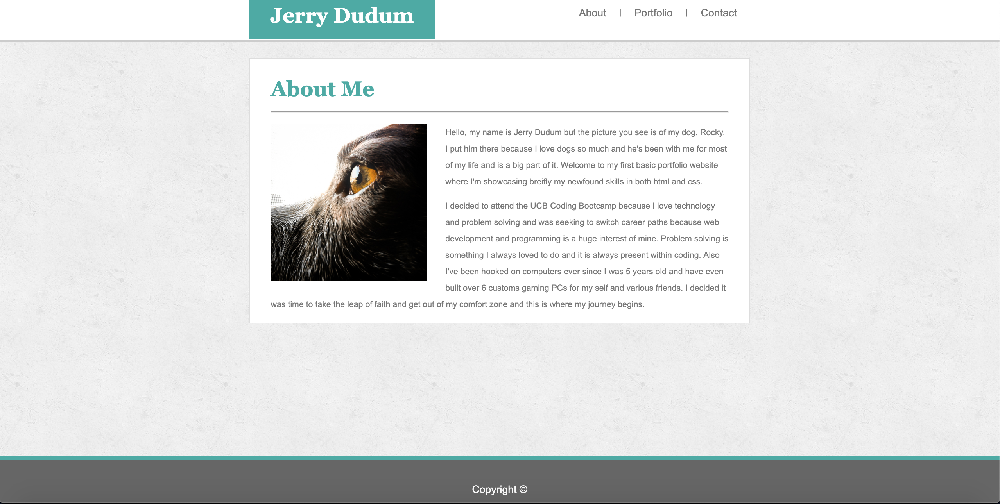
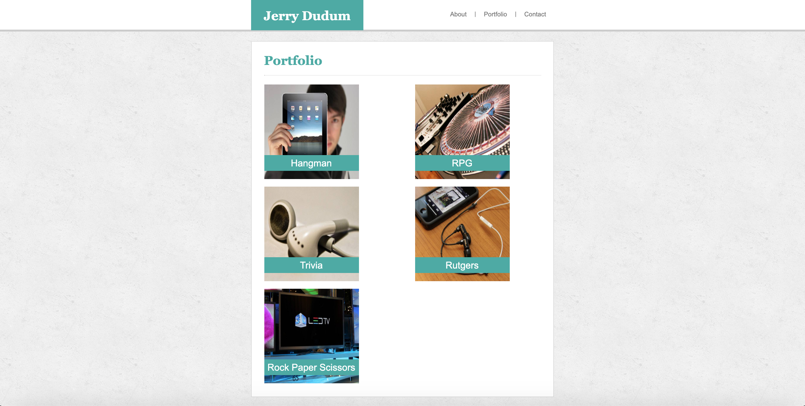
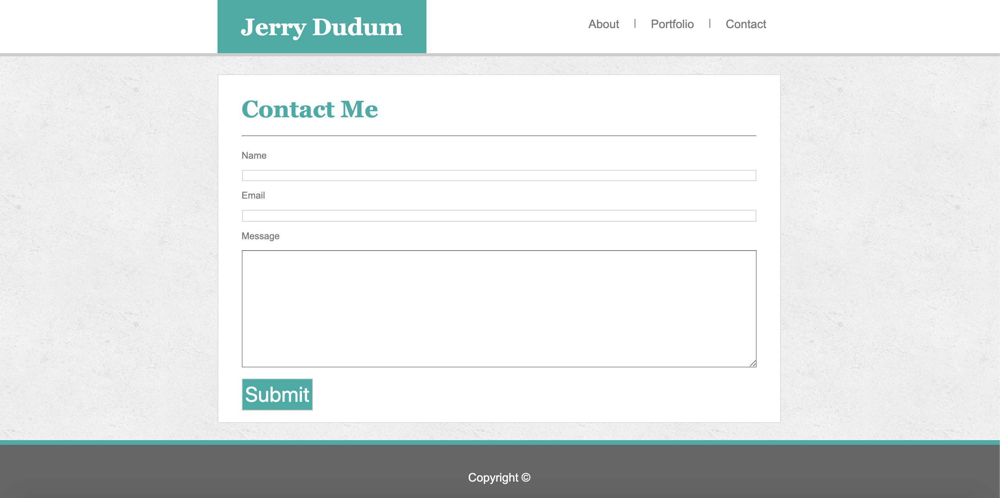
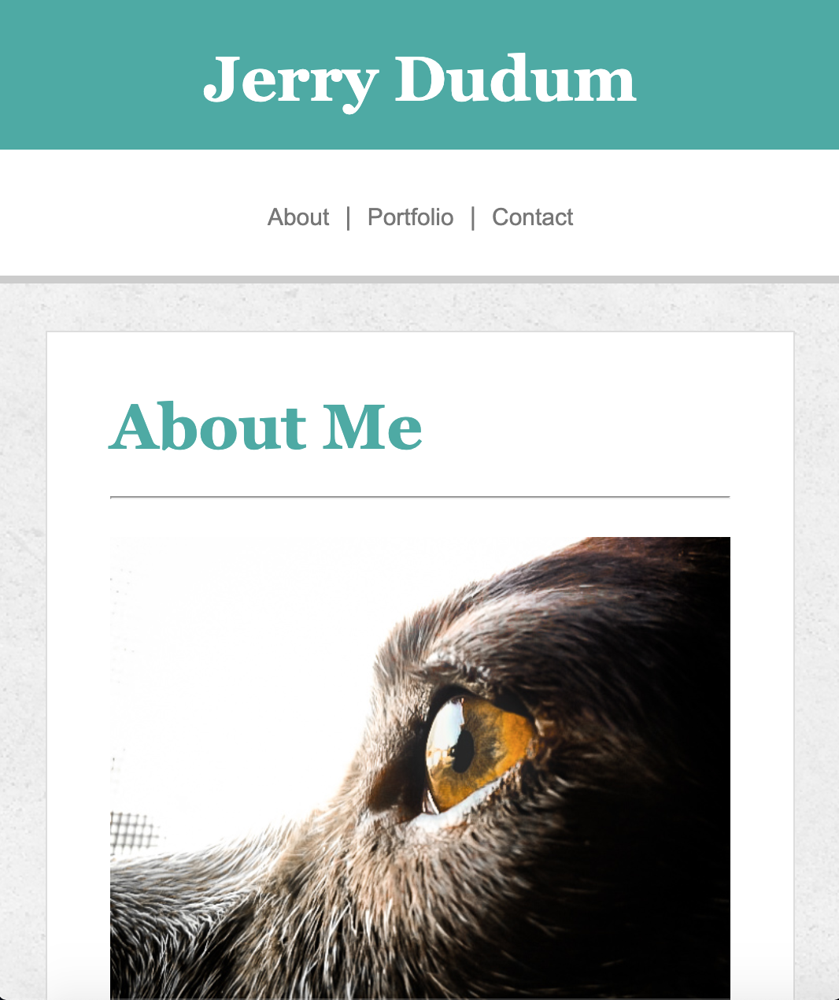
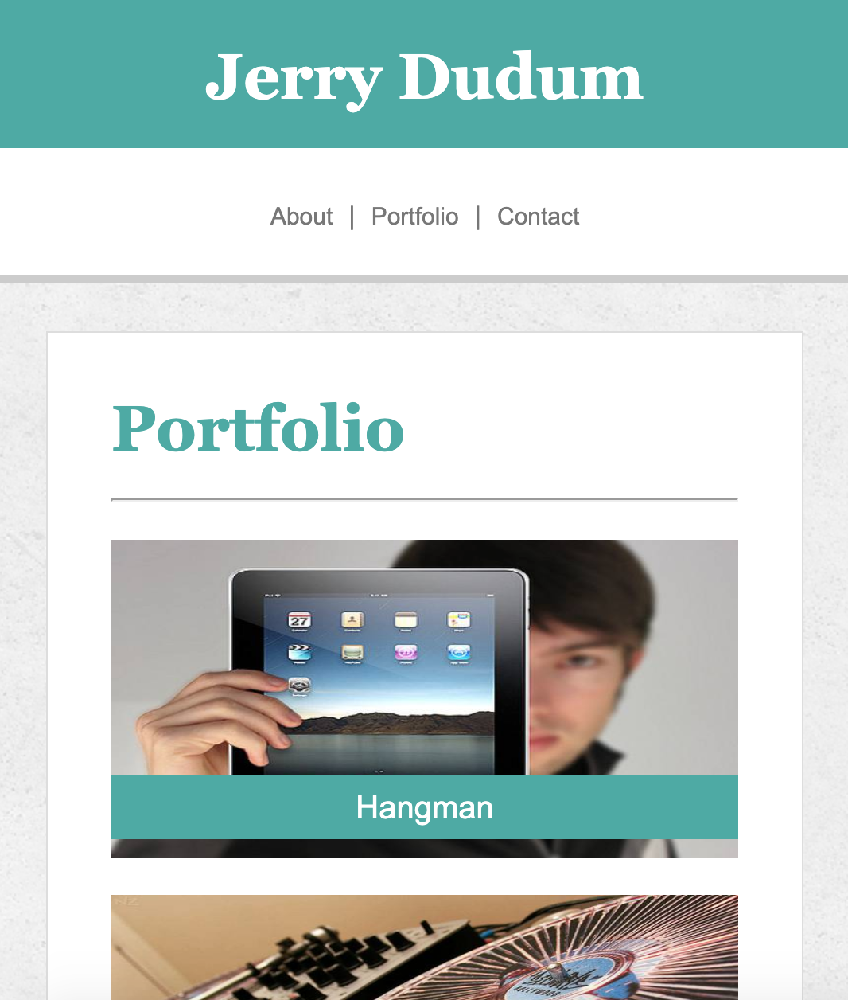
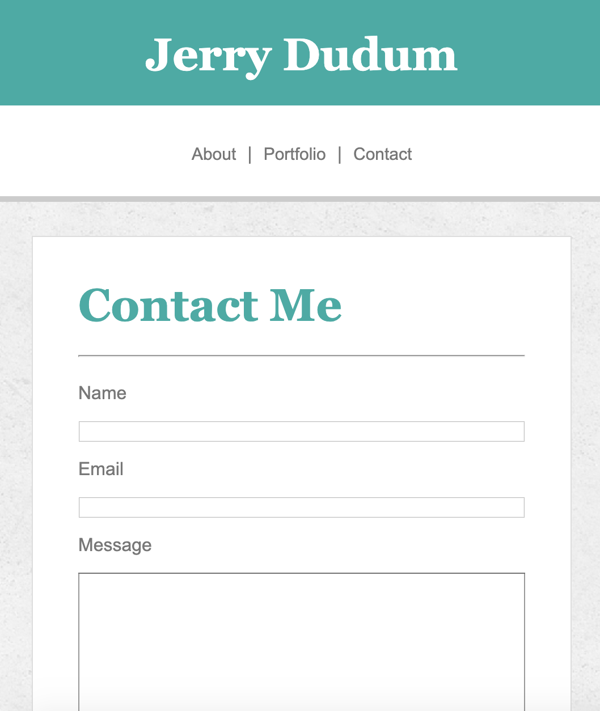

# Responsive-Portfolio

## Site Pictures

## Technologies Used
- HTML 
- CSS
- Git
- GitHub

## Summary

This application is my first portfolio page with media queries to make it responsive to certain screen widths.

### Links
- [Basic-Portfolio](https://jerry-dudum.github.io/Responsive-Portfolio/)
- [LinkedIn](https://www.linkedin.com/in/jsdudum/)